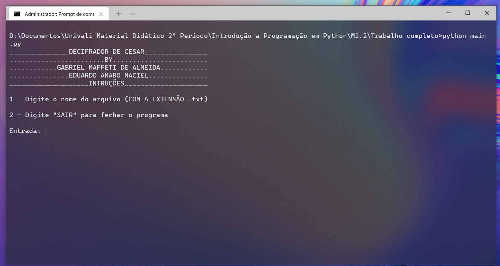
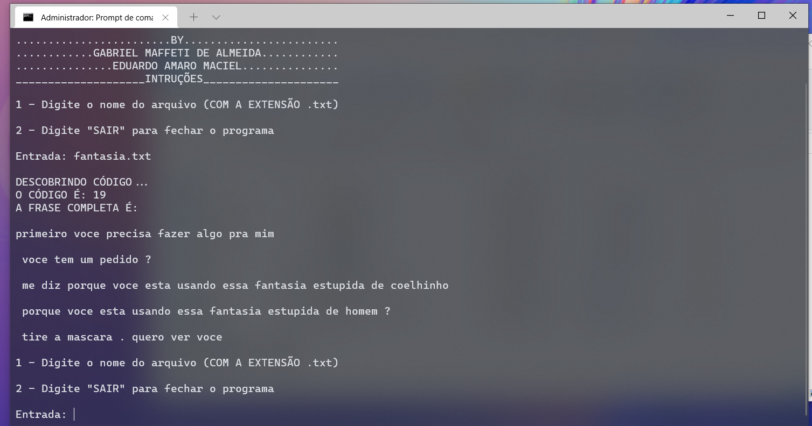

# Decifrador de Cifra de César
Este foi um programa desenvolvido para a disciplina de Introdução a Programação em Python, onde desenvolvi, junto de meu colega Eduardo Amaro Maciel, um decifrador de Cifra de César, que lê um arquivo .txt, descobre seu código, e retorna ele decifrado.

